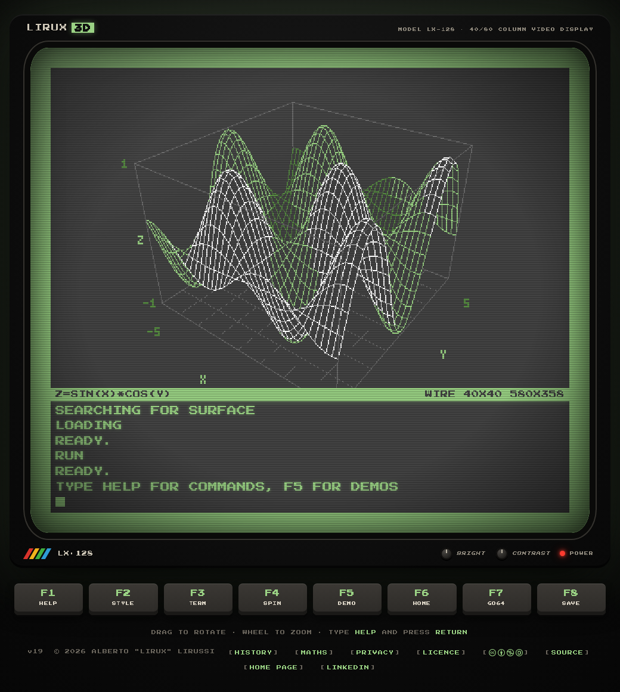
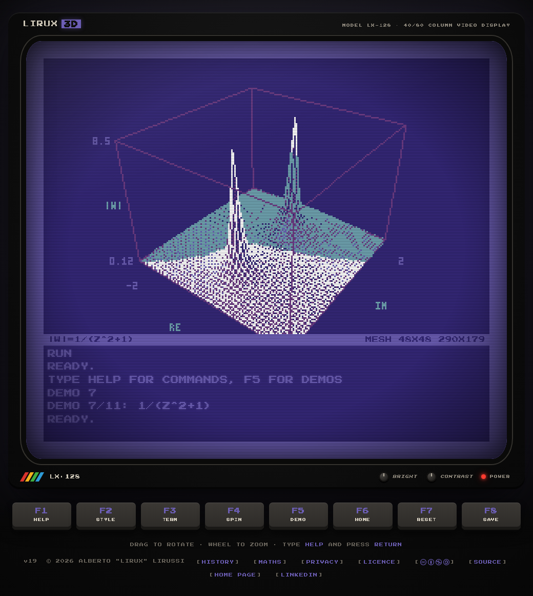
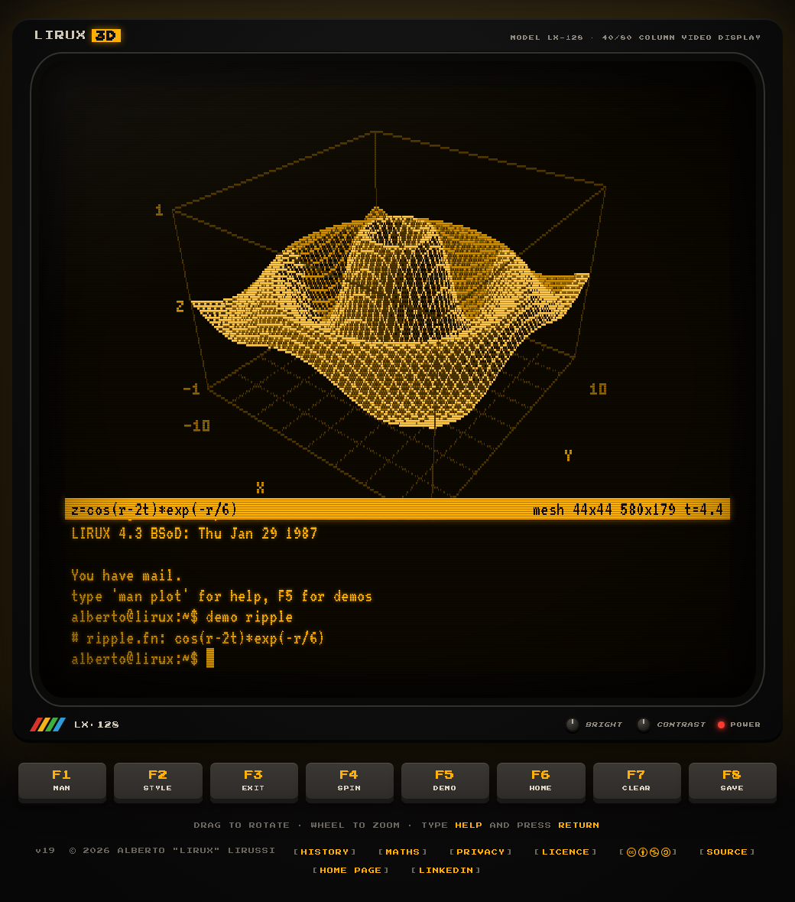

# LX-128 Surface Retroplot

Type a formula, get a 3D surface. Real or complex. Like it's 1985.

**[Try it live: alirux.github.io/lx-128-surface-retroplot](https://alirux.github.io/lx-128-surface-retroplot/)**



A 3D function plotter disguised as an 80s home computer with its monitor. You type
`sin(x)*cos(y)` at the `READY.` prompt and the machine draws the surface with chunky pixels,
ordered dithering and hidden line removal, on a screen with scanlines and phosphor glow.

It is a single static page: plain HTML, CSS and JavaScript, no build step, no dependencies. The
only network call is an anonymous, cookieless visit counter (GoatCounter). The surface is rasterised in software into a tiny pixel buffer and only scaled up
by the browser.

## Three machines, one plotter

| 128 mode | 64 mode | Amber terminal |
|---|---|---|
|  |  |  |
| Light green on dark grey, 80 column hi-res: twice the pixels both ways. The machine you boot into. | Light blue on blue, 40 columns, big square pixels. Type `GO64` and answer `Y`. `RESET` brings you back. | A serial terminal dialled into a time sharing box, in amber, lowercase. Type `TERM`, log in, `exit` to hang up. |

## Formulas

Type a formula and press RETURN.

- **Real surfaces** `z = f(x, y)`: `sin(x)*cos(y)`, `x^3-3x*y^2`, `sin(r)/r`
- **Complex functions** `w = f(z)`: as soon as a formula uses `z` or `i`, the height becomes
  `|w|` and the brightness follows the argument of `w` (monochrome domain colouring):
  `1/(z^2+1)`, `gamma(z)`, `log(z)`
- **Animations**: use `t`, the time in seconds: `cos(r-2t)*exp(-r/6)`

Variables: `x y r th t` and, for complex functions, `z i`. Constants: `pi e tau phi`.

Implicit products work as on paper (`2x`, `xy`, `x(y+1)`), and so do `|x|`, `n!` and
`sin x`. Functions: `sin cos tan asin acos atan sinh cosh tanh sec csc cot exp log ln log10
log2 sqrt cbrt abs sign floor ceil round gamma re im arg conj min max atan2 mod pow hypot`.

The formula is kept in the address after `#`, so a link shares a plot:
[`#sin(x^2+y^2-t)/(1+x^2+y^2)`](https://alirux.github.io/lx-128-surface-retroplot/#sin(x%5E2%2By%5E2-t)%2F(1%2Bx%5E2%2By%5E2)).

## Commands

| Command | What it does |
|---|---|
| `HELP` / `man plot` | list of commands |
| `RUN` | draw the plot again |
| `RANGE A B [C D]` | x (and y) range |
| `ZRANGE A B` / `ZRANGE AUTO` | height range, automatic clipping of poles by default |
| `GRID N` | mesh size, 8 to 96 |
| `STYLE WIRE\|SOLID\|MESH\|DOTS` | rendering style |
| `VIEW ABS\|LOG\|RE\|IM` | height of complex functions |
| `SPIN [ON\|OFF]`, `HOME` | rotation and view reset |
| `DEMO [N]` | eleven demos, from the sombrero to the gamma function |
| `LIST`, `FUNCS`, `SAVE`, `CLS` | listing, functions, PNG export, clear screen |
| `GO64`, `RESET`, `TERM` | switch machine |

Drag to rotate, use the wheel to zoom, or the arrow keys on the plot. The F1 to F8 keys under
the monitor are the same on your keyboard.

### Man pages

The amber terminal and the pages of the site speak the same language: manual pages. In the terminal `man` alone lists them, `man plot` is shown on screen and the others open the corresponding page of the site.

| Page | Where | What it covers |
|---|---|---|
| `plot(1)` | type `man plot` (or F1) in the amber terminal | commands and formula syntax |
| `history(7)` | `man history` in the amber terminal, or [history.html](https://alirux.github.io/lx-128-surface-retroplot/history.html) | the 128 at home, the VT220 at school, WarGames |
| `maths(7)` | `man maths` in the amber terminal, or [maths.html](https://alirux.github.io/lx-128-surface-retroplot/maths.html) | surfaces, complex numbers, domain colouring, zeros, poles and branch cuts |
| `privacy(7)` | `man privacy` in the amber terminal, or [privacy.html](https://alirux.github.io/lx-128-surface-retroplot/privacy.html) | what the page does with your data |
| `licence(7)` | `man licence` in the amber terminal, or [licence.html](https://alirux.github.io/lx-128-surface-retroplot/licence.html) | Apache 2.0 for the code, CC BY-NC-SA 4.0 for the content |

In 128 and 64 mode the same commands as `plot(1)` are listed by `HELP`.

### Shall we play a game?

Rumour has it that a professor left a backdoor on the time sharing box, back in 1983. If you
remember the film, you already know what to do: dial the mainframe with `TERM` and, at the
`login:` prompt, type the name he gave to his son. If you don't, try logging in as the professor
himself, or read the BUGS section of `man plot`.

Be polite with the machine, and think twice before choosing a game.

## Inspiration

Why a 3D function plotter? Because when I had my Commodore 128 (I still have it!) plotting
mathematical surfaces was one of my favourite nerd projects: a few lines of BASIC, a formula, and
then a long wait while the wireframe slowly appeared on the screen, line after line. This page is
the same idea, only much faster.

The same notes are on the [history page](https://alirux.github.io/lx-128-surface-retroplot/history.html) of the plotter. The machines it pays homage to:

- [Commodore 128](https://en.wikipedia.org/wiki/Commodore_128): the 128 mode, with its 80 column
  hi-res screen, the light green on dark grey colours and `GO64`;
- [Commodore 64](https://en.wikipedia.org/wiki/Commodore_64): the 64 mode, light blue on blue,
  with its famous startup banner;
- [VT220](https://en.wikipedia.org/wiki/VT220): the amber serial terminal, a window on the Unix
  machines of the time and heir of the [VT100](https://en.wikipedia.org/wiki/VT100). It is the
  terminal I used at school, in the computer lab;
- [WarGames](https://en.wikipedia.org/wiki/WarGames): the 1983 film behind the easter egg.

### DLOAD or LOAD?

At boot the machine loads the `SURFACE` program from disk, and the command depends on the mode:

- in **128 mode** it types `DLOAD"SURFACE"`, the native disk command of BASIC 7.0: it loads a
  BASIC program from drive 8 without having to name the device. The classic `LOAD"SURFACE",8`
  works on the 128 too, but `DLOAD` is what 128 users typed every day;
- in **64 mode** BASIC V2 has no disk commands of its own, so it types `LOAD"SURFACE",8,1`.

Strictly speaking the final `,1` loads a file at the address stored in the file itself, which
mattered for machine code and games: a BASIC program like `SURFACE` would only need
`LOAD"SURFACE",8`. The page keeps `,8,1` anyway, because it is the form everybody remembers.

## The maths behind it

A real formula `z = f(x, y)` is the graph of a function of two variables: the plotter samples it
on a grid and joins the samples into a mesh. `r` and `th` are the polar coordinates of the point,
`t` is the time.

A complex formula `w = f(z)` would need four dimensions to be drawn honestly, two for `z` and
two for `w`. The plotter keeps `z = x + iy` on the floor of the box (the RE and IM axes) and
squeezes `w` into the other two:

- the **height** is the modulus `|w|`, its distance from zero (`VIEW RE`, `VIEW IM` and
  `VIEW LOG` show the real part, the imaginary part or `ln|w|` instead);
- the **brightness**, in the SOLID and MESH styles, follows the argument of `w`, the angle it
  makes with the positive real axis: this is domain colouring with a single phosphor instead of
  a rainbow.

On such a surface a few landmarks stand out: **zeros**, where the surface touches the floor
(`z^3-1`), **poles**, where it shoots up forever and gets clipped (`1/(z^2+1)`), and **branch
cuts**, where functions like `log(z)` or `sqrt(z)` jump because only their principal value is
used (try `log(z)` with `VIEW IM`). `gamma(z)` extends the factorial, `gamma(n+1) = n!`, and is
computed with the Lanczos approximation.

The [maths page](https://alirux.github.io/lx-128-surface-retroplot/maths.html) of the plotter
explains all this in more detail. Further reading on Wikipedia:
[complex numbers](https://en.wikipedia.org/wiki/Complex_number),
[complex analysis](https://en.wikipedia.org/wiki/Complex_analysis),
[domain colouring](https://en.wikipedia.org/wiki/Domain_coloring),
[zeros and poles](https://en.wikipedia.org/wiki/Zeros_and_poles),
[branch points](https://en.wikipedia.org/wiki/Branch_point),
[complex logarithm](https://en.wikipedia.org/wiki/Complex_logarithm),
[gamma function](https://en.wikipedia.org/wiki/Gamma_function),
[z-buffering](https://en.wikipedia.org/wiki/Z-buffering) and
[ordered dithering](https://en.wikipedia.org/wiki/Ordered_dithering).

## Run it locally

Any static web server will do, for example:

```
python3 -m http.server 8765
```

and open <http://localhost:8765>. Opening `index.html` straight from the disk works too.

The build number shown in the footer (`v…`, before the copyright) lives in the
[`VERSION`](VERSION) file and is mirrored in the three HTML pages. A `pre-commit` hook bumps it
by one on every commit; install it once after cloning with:

```
tools/hooks/install.sh
```

## Security

Every page declares a Content Security Policy and a Referrer Policy with `<meta>` tags in the
`<head>`: the browser loads only resources from this site, plus the GoatCounter script and its
counting endpoint on the plotter page. The privacy and licence pages load nothing external.

Headers such as `X-Frame-Options`, `X-Content-Type-Options`, `Permissions-Policy` and the
`frame-ancestors` directive travel only as HTTP headers, which GitHub Pages does not let you set.

## Project layout

| Path | Content |
|---|---|
| `index.html`, `style.css` | the page, the monitor and the three screen themes |
| `js/parser.js` | formula parser, real and complex arithmetic, gamma function |
| `js/render.js` | software rasteriser: z-buffer, dithering, bitmap font |
| `js/app.js` | the machines: command line, boot sequences, keys, easter egg |
| `js/analytics.js` | anonymous visit counting with GoatCounter |
| `history.html` | the historical notes behind the project, as a man page |
| `maths.html` | the mathematics behind the plotter, as a man page |
| `privacy.html`, `licence.html` | privacy and licence notices, as man pages |
| `fonts/` | the two typefaces, served from the site |
| `assets/` | screenshots and social card |
| `favicon.svg`, `favicon.ico`, `apple-touch-icon.png` | the LX-128 in pixel art |

## Licence

Two licences, as for the rest of my site:

- the **code** (`js/`, `style.css`, the HTML markup) is under the
  [Apache License 2.0](LICENSE);
- the **content** (the visual design of the monitor and of the screens, the texts, the
  screenshots and the social card) is under
  [CC BY-NC-SA 4.0](LICENSE-CONTENT.txt).

The typefaces [Press Start 2P](fonts/OFL-PressStart2P.txt) and [VT323](fonts/OFL-VT323.txt)
belong to their authors and come with the SIL Open Font License 1.1. Details in
[NOTICE](NOTICE) and on the [licence page](https://alirux.github.io/lx-128-surface-retroplot/licence.html).

Made by Alberto "lirux" Lirussi: [Home page](https://alirux.github.io/) ·
[LinkedIn](https://www.linkedin.com/in/alberto-lirussi/)
